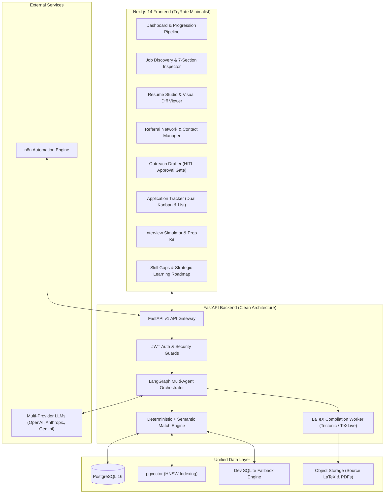

# 🚀 CareerPilot AI
> **AI-Powered Job Search, Resume Tailoring, Referral & Interview Copilot**

[](docs/architecture.md)
[](https://fastapi.tiangolo.com)
[](https://nextjs.org)
[](https://github.com/pgvector/pgvector)
[](https://langchain-ai.github.io/langgraph/)
[](docs/decisions.md#adr-004-zero-hallucination--fact-grounding-verification-subsystem)
[](docs/design-system.md)

---

## 📖 Overview

**CareerPilot AI** is an enterprise-grade, end-to-end intelligent career assistant that manages the full lifecycle of modern job hunting. It transforms how professionals navigate their job search by combining:

1. **Executive White Minimalist UI:** Complete redesign inspired by [TryRote](https://tryrote.com/) featuring pristine white surfaces, deep charcoal typography, subtle borders, translucent glass navbar, and micro-interactions.
2. **Deep Candidate Understanding:** Ingests structured profiles, projects, skills, GitHub repositories, and existing LaTeX/PDF resumes.
3. **Deterministic & Semantic Matching:** Evaluates job descriptions using deterministic structured rules and dense semantic vector search via `pgvector` with evidence citations.
4. **Strict Zero-Hallucination Resume Tailoring:** Reorganizes, rewords, and emphasizes genuine candidate achievements into customized LaTeX resumes with automated fact-checking that guarantees **zero fabricated claims or metrics**.
5. **Automated LaTeX-to-PDF Compilation:** Generates ATS-compliant PDF resumes with side-by-side diff previews.
6. **Ethical Referral & Outreach Copilot:** Identifies permitted referral opportunities and generates personalized email/LinkedIn connection drafts with mandatory **Human-in-the-Loop (HITL)** approval.
7. **Application Tracker & CRM:** Full dual Kanban (8 stages) and List view with follow-up scheduling.
8. **Interview Co-Pilot:** 5-category interview prep kit and interactive multi-turn AI mock interview simulator.
9. **Market Skill Gap Analytics:** Analyzes recurring market requirements and outputs 3-phase strategic learning roadmaps grounded by GitHub evidence.

---

## 🏛️ System Architecture



---

## 🛠️ Technology Stack

| Layer | Technologies |
|---|---|
| **Frontend** | Next.js 14 (App Router), React 18, TypeScript, Tailwind CSS, Lucide Icons, Glassmorphic Backdrop Blur |
| **Backend** | Python 3.11+, FastAPI, Pydantic v2, SQLAlchemy 2.0 (Async), Alembic |
| **Multi-Agent Orchestration** | LangGraph, LangChain, Structured Output Parsers |
| **Database & Vector Store** | PostgreSQL 16 with `pgvector` extension (with automatic SQLite fallback for dev) |
| **Document Processing** | Tectonic / TeXLive (Sandboxed LaTeX compilation), PyMuPDF / pdfplumber |
| **Automation & Scheduling** | n8n Workflow Automation Engine (Free Self-Hosted Community Edition) |
| **Multi-Source Job Discovery** | Modular Adapters (LinkedIn, FreshersHunt, Indeed, Company Careers, Public Feeds) • [Discovery Architecture](docs/job-discovery.md) |
| **Testing & QA** | Pytest, Pytest-Asyncio (73/73 tests passing), Next.js Typecheck & Production Build |

---

## 🛡️ Non-Negotiable Safety & Integrity Invariants

### 1. Strict Anti-Hallucination Policy (ADR-004)
The resume tailoring and interview agents **NEVER** fabricate:
- ❌ Work experience or previous employers
- ❌ Projects or product initiatives
- ❌ Technologies or programming languages
- ❌ Certifications or licenses
- ❌ Educational degrees or institutions
- ❌ Achievements or quantitative metrics
- ❌ Job titles or promotion timelines

Every output is checked against the candidate's canonical fact records before PDF compilation.

### 2. Mandatory Human-In-The-Loop Approval (ADR-006)
- ❌ No unauthorized scraping or bot credential automation.
- ❌ No automatic transmission of job applications or cold outreach messages.
- ✅ All email and LinkedIn messages are staged as drafts in `NEEDS_REVIEW` until approved by the candidate.

---

## 🚀 Running the Application Locally

### 1. Backend Setup

```bash
# From repository root
cd /Users/zaidhaque/Desktop/CareerPilot

# Activate virtual environment
source .venv/bin/activate

# Install dependencies (if needed)
pip install -r backend/requirements.txt

# Start FastAPI server
uvicorn backend.app.main:app --host 0.0.0.0 --port 8000 --reload
```
API Documentation will be available at: `http://localhost:8000/docs`

### 2. Frontend Setup

```bash
# From repository root
cd frontend

# Install dependencies (if needed)
npm install

# Start Next.js development server
npm run dev
```
Application will be available at: `http://localhost:3000`

### 3. Local n8n Community Edition Setup (Automation Layer)

CareerPilot uses the **free, self-hosted n8n Community Edition** locally (no cloud or trial license required).

```bash
# From repository root
./scripts/start_n8n.sh
```
- n8n Web UI: `http://localhost:5678`
- Health Endpoint: `http://localhost:5678/healthz`
- Data Persistence: SQLite database at `data/n8n/.n8n/database.sqlite` (survives restarts)
- Webhook Endpoint: `http://localhost:5678/webhook/careerpilot-test`
- See [n8n Architecture & Setup Guide](docs/n8n.md) for full architecture and HITL safety policies.

### 4. Running the Complete Stack (Frontend + Backend + n8n)

```bash
# Terminal 1: FastAPI Backend
source .venv/bin/activate
uvicorn backend.app.main:app --host 127.0.0.1 --port 8000 --reload

# Terminal 2: Next.js Frontend
cd frontend && npm run start -- -H 127.0.0.1 -p 3000

# Terminal 3: Local n8n Community Edition
./scripts/start_n8n.sh
```

### 5. Testing & Verification

```bash
# Run all backend unit & integration tests (including n8n integration tests)
.venv/bin/pytest backend/tests/ -v

# Check n8n status from FastAPI
curl -s http://localhost:8000/api/v1/n8n/status

# Test FastAPI -> n8n webhook dispatch
curl -s -X POST http://localhost:8000/api/v1/n8n/dispatch-test

# Test n8n -> FastAPI health query
curl -s http://localhost:5678/webhook/careerpilot-health-check
```

---

## 📚 Documentation Index

- [n8n Architecture & Setup Guide](docs/n8n.md)
- [Full Project Audit Report](docs/full-project-audit.md)
- [Design System & UI Specification](docs/design-system.md)
- [System Architecture](docs/architecture.md)
- [Testing & Quality Assurance Guide](docs/testing.md)
- [Architecture Decision Records (ADRs)](docs/decisions.md)
- [Implementation Roadmap](docs/roadmap.md)
