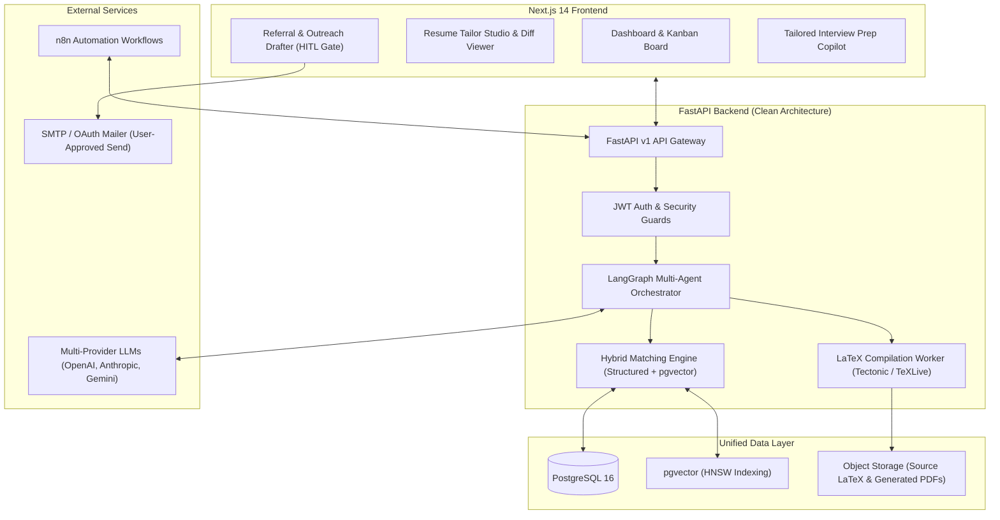

# 🚀 CareerPilot AI
> **AI-Powered Job Search, Resume Tailoring, Referral & Interview Copilot**

[](docs/architecture.md)
[](https://fastapi.tiangolo.com)
[](https://nextjs.org)
[](https://github.com/pgvector/pgvector)
[](https://langchain-ai.github.io/langgraph/)
[](docs/decisions.md#adr-004-zero-hallucination--fact-grounding-verification-subsystem)

---

## 📖 Overview

**CareerPilot AI** is an enterprise-grade, end-to-end intelligent career assistant that manages the full lifecycle of modern job hunting. It transforms how software engineers and professionals navigate their career search by combining:

1. **Deep Candidate Understanding:** Ingests structured profiles, projects, skills, and existing LaTeX resumes.
2. **Intelligent JD Analysis & Hybrid Matching:** Evaluates job descriptions using deterministic structured rules and dense semantic vector search via `pgvector` with evidence citations.
3. **Strict Zero-Hallucination Resume Tailoring:** Reorganizes, rewords, and emphasizes genuine candidate achievements into customized LaTeX resumes—with automated fact-checking that guarantees **zero fabricated claims or metrics**.
4. **Automated LaTeX-to-PDF Compilation:** Generates pristine, ATS-compliant PDF resumes with side-by-side diff previews.
5. **Ethical Referral & Outreach Copilot:** Identifies permitted referral opportunities and generates personalized email/LinkedIn connection drafts with mandatory **Human-in-the-Loop (HITL)** approval.
6. **Application & Interview Tracker:** End-to-end Kanban board paired with tailored behavioral, technical, and system design interview preparation packs.
7. **Skill Gap Analytics & Automation:** Analyzes recurring market skill gaps and automates recurring search workflows with **n8n**.

---

## 🏛️ System Architecture



---

## 🛠️ Technology Stack

| Layer | Technologies |
|---|---|
| **Backend** | Python 3.11+, FastAPI, Pydantic v2, SQLAlchemy 2.0 (Async), Alembic |
| **Agent Orchestration** | LangGraph, LangChain, Structured Output Parsers |
| **Frontend** | Next.js 14 (App Router), React 18, TypeScript, Tailwind CSS, Lucide Icons, TanStack Query |
| **Database & Vector Store** | PostgreSQL 16 with `pgvector` extension (HNSW vector indexing) |
| **Document Processing** | Tectonic / TeXLive (Sandboxed LaTeX compilation), PyMuPDF / pdfplumber |
| **Automation & Scheduling** | n8n Workflow Automation Engine |
| **DevOps & Infrastructure** | Docker, Docker Compose, Pytest, Structlog |

---

## 🛡️ Critical Safety & Integrity Invariants

### 1. Strict Anti-Hallucination Policy (ADR-004)
The resume tailoring agent **NEVER** fabricates:
- ❌ Work experience or previous employers
- ❌ Projects or product initiatives
- ❌ Technologies or programming languages
- ❌ Certifications or licenses
- ❌ Educational degrees or institutions
- ❌ Achievements or quantitative metrics
- ❌ Job titles or promotion timelines

Every output bullet point is checked against the candidate's canonical fact records before PDF compilation.

### 2. Ethical Referral & Outreach Standards (ADR-006)
- ❌ No unauthorized LinkedIn scraping or credential automation.
- ❌ No automated bot messaging.
- ✅ All messages are generated as drafts requiring explicit human review and approval prior to sending.

---

## 📂 Repository Structure

```
CareerPilot/
├── docs/                      # Architectural and operational documentation
│   ├── architecture.md        # Detailed system design and component specs
│   ├── roadmap.md             # Phase-by-phase implementation plan
│   └── decisions.md           # Architecture Decision Records (ADRs)
├── backend/                   # FastAPI Clean Architecture backend
│   ├── app/
│   │   ├── api/               # Versioned REST endpoints & middleware
│   │   ├── core/              # Config, database, security, and logging
│   │   ├── domain/            # Domain entities and value objects
│   │   ├── schemas/           # Pydantic DTOs for request/response
│   │   ├── services/          # Core business logic & match engine
│   │   ├── agents/            # LangGraph multi-agent graphs & state
│   │   └── infrastructure/    # DB repositories, vector store & LLM clients
│   ├── tests/                 # Unit and integration test suites
│   ├── alembic/               # Database migrations
│   ├── requirements.txt       # Python backend dependencies
│   └── Dockerfile             # Backend container definition
├── frontend/                  # Next.js 14 application
│   ├── src/
│   │   ├── app/               # App Router pages & layouts
│   │   ├── components/        # Reusable UI components
│   │   ├── hooks/             # Custom React hooks
│   │   ├── lib/               # API clients and utilities
│   │   └── types/             # TypeScript type definitions
│   ├── package.json           # Frontend dependencies
│   └── Dockerfile             # Frontend container definition
├── docker-compose.yml         # Local multi-container development environment
├── .env.example               # Template for environment variables
└── README.md                  # Project overview and guide
```

---

## 🧭 Implementation Roadmap

- **Phase 0:** Project Architecture, Standards & Scaffolding *(Completed)*
- **Phase 1:** Core Foundation, Database Layer & Candidate Profile Ingestion *(Next Up)*
- **Phase 2:** Job Ingestion, Structured Parsing & Hybrid Matching Engine
- **Phase 3:** Zero-Hallucination Resume Tailoring & LaTeX/PDF Compilation
- **Phase 4:** Referral Discovery, Outreach Generation & HITL Review Hub
- **Phase 5:** Application Tracking & Tailored Interview Prep Copilot
- **Phase 6:** Skill Gap Analytics, Learning Recommendations & n8n Automation
- **Phase 7:** Production Hardening, Testing, Security & Observability

For detailed phase tasks and deliverables, see [docs/roadmap.md](docs/roadmap.md).

---

## 🚀 Getting Started (When Phase 1 is Initiated)

### 1. Prerequisites
- [Docker & Docker Compose](https://www.docker.com/)
- [Python 3.11+](https://www.python.org/)
- [Node.js 18+](https://nodejs.org/)

### 2. Environment Setup
```bash
# Copy environment configuration
cp .env.example .env

# Configure your API keys (OpenAI, Anthropic, etc.) in .env
```

### 3. Launching the Local Stack
```bash
# Start PostgreSQL with pgvector, Backend, and Frontend
docker-compose up -d
```

---

## 📄 License & Ethical Standards
This project is built for professional, ethical, and high-impact career development. All outreach and application operations are designed to uphold transparency and human oversight.
