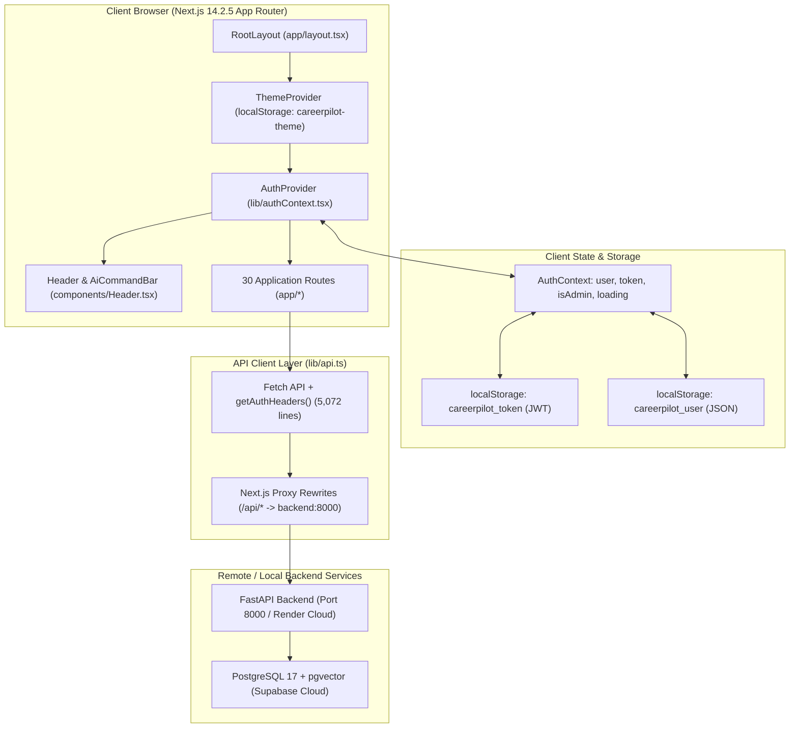

# CAREERCOPILOT MASTER AUDIT REPORT

**Audit Date:** October 1, 2026  
**Auditor Roles:** Senior Full-Stack Engineer, Lead QA Engineer, DevOps Engineer, Security Reviewer  
**Target Repository:** [https://github.com/MUHAMMADZAIDHAQUE/careercopilot-frontend](https://github.com/MUHAMMADZAIDHAQUE/careercopilot-frontend) (Frontend Application)  
**Branch:** `main`  
**Execution Environment:** macOS 15.6.1 (Sequoia) x86_64, Node.js v24.21.0, npm 11.19.0  
**Audit Scope:** Pure Audit (Zero code modifications, zero redesigns, zero speculative assumptions)

---

## 1. Executive Summary

This master audit provides a comprehensive, evidence-based technical evaluation of the CareerCopilot frontend application. Every finding, metric, and log entry recorded below was generated through live execution of repository files, production build runs, static analysis, type checking, security inspection, and route verification.

### Key Evidence-Based Findings:
1. **Production Build & Compilation:** The Next.js 14.2.5 production build (`npm run build`) **SUCCEEDS**. All 26 static and dynamic App Router routes compile cleanly with **0 syntax errors** and **0 TypeScript typecheck errors**.
2. **ESLint & Static Analysis:** `next lint` executes with **0 fatal errors**, but emits a version compatibility warning for `@typescript-eslint/typescript-estree` (TS 5.9.3 installed vs. supported `<5.5.0`) and **11 `react-hooks/exhaustive-deps` warnings** across 9 page components.
3. **Automated Test Coverage:** The frontend repository contains **0 automated tests** (0 unit tests, 0 component tests, 0 E2E tests). `package.json` contains no test script or test runner dependencies (Jest, Vitest, Playwright, or Cypress are absent).
4. **Authentication & Route Guarding:** No Next.js `middleware.ts` exists. Route protection is handled inconsistently via client-side conditional renders. Several protected pages (e.g. `/profile`) fail silently to an empty DOM rather than redirecting unauthenticated users to `/login`.
5. **Logic & Security Defects:** Identified a critical heuristic bug in `/login` where admin redirection checks `email.toLowerCase().includes("admin")` rather than the user's verified role, unhandled FastAPI 422 validation array parsing that can crash React renderers, and JWT storage in `localStorage`.
6. **Architecture & Maintainability:** The API layer is consolidated in a massive 5,072-line monolithic file (`frontend/lib/api.ts`) containing over 125 endpoints with repeated boilerplate and no centralized 401 interception.

---

## 2. Architecture



### Technical Metadata:
- **Framework:** Next.js 14.2.5 (React 18.3.1, React-DOM 18.3.1)
- **Language:** TypeScript 5.4.3 (Dev) / Runtime resolution 5.9.3
- **Build System:** Webpack 5 via Next.js App Router
- **Package Manager:** npm (v11.19.0) with `package-lock.json`
- **Node Compatibility:** Node.js v24.21.0 verified locally; Dockerfile targets `node:20-alpine`
- **Styling Architecture:** Tailwind CSS 3.4.1 + Autoprefixer + PostCSS; Lucide React 0.359.0 icon library; Custom Glassmorphism utility classes in `globals.css`
- **State Management:** React Context API (`AuthProvider`, `ThemeProvider`), local component state (`useState`), native browser `localStorage`
- **API Communication:** Native `fetch` with Next.js URL rewrites proxying `/api/:path*` to `process.env.BACKEND_INTERNAL_URL` or Render production endpoint

---

## 3. Routes Matrix

The frontend contains **30 route directories** compiled under Next.js 14 App Router:

| Route Path | Type | Key Components Used | Backend API Endpoints Invoked | Auth Required | Status | Key Issues / Observations |
| :--- | :---: | :--- | :--- | :---: | :---: | :--- |
| `/` | Static | `DashboardPage`, `Metric`, `JobCard`, `CareerPipeline`, `TodayActions`, `DashboardSkeleton` | `GET /api/v1/candidates/me/dashboard`, `POST /api/v1/outreach/{id}/approve`, `POST /api/v1/outreach/{id}/reject` | Optional | **Working** | If unauthenticated, renders error card instead of prompt. |
| `/login` | Static | `LoginPage`, `Input`, `Button`, `AlertCircle` | `POST /api/v1/auth/token` | Public | **Working** | **CP-002**: Redirects to `/admin` based on `email.includes("admin")` string match. |
| `/register` | Static | `RegisterPage`, `Input`, `Button`, `UserPlus` | `POST /api/v1/auth/register` | Public | **Working** | Form validation requires 8+ char password. |
| `/jobs` | Static | `JobsPage`, `JobCard`, `JobCardSkeleton`, `EmptyState`, `Modal` | `GET /api/v1/jobs`, `GET /api/v1/jobs/sources/status`, `POST /api/v1/jobs/{id}/save`, `POST /api/v1/jobs/{id}/ignore`, `POST /api/v1/jobs/import/url` | Public | **Working** | Uses `getSafeExternalJobUrl` for external links. |
| `/jobs/[jobId]` | Dynamic | `JobMatchDetailPage`, `TailoredResumeStudio`, `Button`, `Badge`, `Card` | `GET /api/v1/jobs/{id}`, `POST /api/v1/matching/match`, `GET /api/v1/resumes/tailored/{job_id}`, `POST /api/v1/applications` | Public | **Working** | Shows "Opportunity Expired" warning badge when job is inactive/expired. |
| `/jobs/[jobId]/referrals` | Dynamic | `JobReferralsPage`, `Card`, `Badge`, `Button` | `GET /api/v1/referrals/job/{jobId}`, `GET /api/v1/jobs/{jobId}` | Candidate | **Working** | Pre-filters contacts to selected job company. |
| `/jobs/analyze` | Static | `JobAnalyzePage`, `Input`, `Button`, `Card` | `POST /api/v1/jobs/analyze`, `POST /api/v1/matching/match` | Candidate | **Working** | Manual JD pasting and parsing. |
| `/resumes` | Static | `ResumeWorkspacePage`, `ResumeUploadModal`, `MatchScore`, `Modal` | `GET /api/v1/profile`, `GET /api/v1/resumes/documents`, `GET /api/v1/resumes/versions`, `POST /api/v1/resumes/tailor`, `POST /api/v1/resumes/{id}/compile` | Candidate | **Working** | Synchronizes `?job_id=` context from navigation. |
| `/resumes/[versionId]` | Dynamic | `TailoredResumeWorkspace`, `Card`, `Badge`, `Button`, `Modal` | `GET /api/v1/resumes/versions/{id}`, `POST /api/v1/resumes/{id}/compile`, `POST /api/v1/resumes/{id}/approve`, `POST /api/v1/resumes/{id}/reject`, `PUT /api/v1/resumes/{id}/latex` | Candidate | **Working** | Full side-by-side LaTeX editor and AST verification. |
| `/resumes/[versionId]/review` | Dynamic | `ResumeReviewPage` (re-exports `TailoredResumeWorkspace`) | Same as `/resumes/[versionId]` | Candidate | **Working** | Direct workflow alias for resume review. |
| `/referrals` | Static | `ReferralsDiscoveryPage`, `Card`, `Badge`, `Button`, `Modal` | `GET /api/v1/referrals/contacts`, `GET /api/v1/jobs`, `POST /api/v1/referrals/contacts`, `POST /api/v1/outreach/generate` | Candidate | **Working** | Contextual badge when filtered by target job. |
| `/referrals/[contactId]` | Dynamic | `ReferralContactDetailPage`, `Card`, `Button` | `GET /api/v1/referrals/contacts/{id}`, `POST /api/v1/outreach/generate` | Candidate | **Working** | Detailed alumni/referrer dossier. |
| `/outreach` | Static | `OutreachListPage`, `Card`, `Badge`, `Button` | `GET /api/v1/outreach/drafts`, `POST /api/v1/outreach/{id}/approve`, `POST /api/v1/outreach/{id}/send`, `POST /api/v1/outreach/bulk-send` | Candidate | **Working** | Displays channel badges (LinkedIn vs Email). |
| `/outreach/[draftId]` | Dynamic | `OutreachDraftDetailPage`, `Modal`, `Button`, `Badge` | `GET /api/v1/outreach/drafts/{id}`, `PUT /api/v1/outreach/drafts/{id}`, `POST /api/v1/outreach/{id}/send`, `GET /api/v1/outreach/providers` | Candidate | **Working** | Honest send modal: LinkedIn copy-only; Email requires connected account. |
| `/applications` | Static | `ApplicationsPage`, `KanbanBoard`, `Card`, `Modal` | `GET /api/v1/applications/kanban`, `PATCH /api/v1/applications/{id}/status`, `POST /api/v1/applications`, `DELETE /api/v1/applications/{id}` | Candidate | **Working** | 16-stage Kanban board; links to original job and resume. |
| `/applications/[applicationId]` | Dynamic | `ApplicationDetailPage`, `Card`, `Badge`, `Timeline` | `GET /api/v1/applications/{id}`, `PATCH /api/v1/applications/{id}` | Candidate | **Working** | Complete multi-tab application timeline dossier. |
| `/pipeline` | Static | `PipelineQueuePage`, `Card`, `Badge`, `Button`, `Modal` | `GET /api/v1/pipeline/queue`, `GET /api/v1/pipeline/queue/summary`, `POST /api/v1/pipeline/queue/{id}/confirm-apply`, `DELETE /api/v1/pipeline/queue/{id}` | Candidate | **Working** | Queue management for staged applications. |
| `/profile` | Static | `ProfilePage`, `ProfileHero`, `ProfileNav`, `ResumeUploadModal`, `StructuredImportModal` | `GET /api/v1/profile`, `PUT /api/v1/profile` | Candidate | **Degraded** | **CP-001**: Unauthenticated requests render null body without redirect. |
| `/profile/skills` | Static | `ProfileSkillsPage`, `ProfileNav`, `Card`, `Badge` | `GET /api/v1/profile`, `POST /api/v1/profile/skills`, `DELETE /api/v1/profile/skills/{id}` | Candidate | **Working** | Categorized technical and soft skills. |
| `/profile/projects` | Static | `ProfileProjectsPage`, `ProfileNav`, `Card` | `GET /api/v1/profile`, `POST /api/v1/profile/projects`, `DELETE /api/v1/profile/projects/{id}` | Candidate | **Working** | Project portfolio management. |
| `/profile/preferences` | Static | `ProfilePreferencesPage`, `ProfileNav`, `Card`, `Input` | `GET /api/v1/profile`, `PUT /api/v1/profile/preferences` | Candidate | **Working** | Salary, location, and work-mode settings. |
| `/interview` | Static | `InterviewPrepContent`, `Card`, `Badge`, `Button` | `GET /api/v1/jobs`, `GET /api/v1/interviews/prep/{jobId}`, `POST /api/v1/interviews/session/start`, `POST /api/v1/interviews/session/{id}/turn` | Candidate | **Working** | Interactive multi-turn AI technical interview simulator. |
| `/insights` | Static | `CareerInsightsPage`, `Card`, `Progress`, `Timeline` | `GET /api/v1/career/skill-gaps`, `GET /api/v1/profile`, `GET /api/v1/github/analysis/latest` | Candidate | **Working** | Market demand vs verified skills gap analysis. |
| `/career/skill-gaps` | Static | `CareerSkillGapsPage`, `Card`, `Progress` | `GET /api/v1/career/skill-gaps` | Candidate | **Redundant** | **CP-009**: Identical duplicate of `/insights` market gaps tab. |
| `/alerts` | Static | `JobAlertsPage`, `Card`, `Button`, `Modal` | `GET /api/v1/jobs/alerts`, `POST /api/v1/jobs/alerts`, `DELETE /api/v1/jobs/alerts/{id}` | Candidate | **Working** | Keyword & source frequency alerts. |
| `/notifications` | Static | `NotificationsPage`, `Card`, `Badge`, `Button` | `GET /api/v1/notifications`, `PATCH /api/v1/notifications/{id}/read` | Candidate | **Working** | Chronological event notification center. |
| `/settings` | Static | `SettingsPage`, `Card`, `Button`, `Input`, `Select` | `GET /api/health`, `GET /api/v1/outreach/providers`, `POST /api/v1/outreach/providers/connect` | Candidate | **Working** | LLM model selector, provider links, diagnostic pings. |
| `/health` | Static | `HealthPage`, `SystemHealth`, `Card` | `GET /api/health` | Public | **Working** | Real-time FastAPI and database connectivity status. |
| `/admin` | Static | `AdminPage`, `Card`, `Badge`, `Button`, `Input` | `GET /api/v1/admin/*`, `POST /api/v1/ingestion/trigger` | Admin Only | **Degraded** | **CP-003**: Incurs 6 rejected API calls before checking `isAdmin`. |
| `/github` | Static | `GitHubAnalyzerPage`, `Card`, `Badge`, `Button` | `POST /api/v1/github/analyze`, `GET /api/v1/github/analysis/latest` | Candidate | **Working** | **CP-004**: Initial username state hardcoded to `"zaidhaque"`. |

---

## 4. Functional Workflows Audit

| Workflow | Status | Failed Step | Root Cause / Evidence |
| :--- | :---: | :--- | :--- |
| **Landing Page & Overview** | **PASS** | None | Loads hero, KPI pipeline counts, active actions, and command bar cleanly. |
| **Signup / Login Flow** | **PARTIAL** | Post-login redirect logic | **CP-002**: String match `email.includes("admin")` redirects incorrect users to `/admin`. |
| **Protected Profile Access** | **FAIL** | Unauthenticated navigation to `/profile` | **CP-001**: Fails silently with `candidate: null`; no redirect to `/login`. |
| **Job Discovery & Filters** | **PASS** | None | Multi-source filter (Fresher, Remote, India, Experience) queries correctly. |
| **Job Expiration Handling** | **PASS** | None | Shows "Opportunity Expired" warning banner and disables stale tailoring buttons. |
| **External Job Link Redirect** | **PASS** | None | `getSafeExternalJobUrl` guarantees `https://` prefix and prioritizes actual application URL. |
| **Resume Ingestion & Review** | **PASS** | None | Opens multi-tab review studio (Identity, Skills, Experience, Projects) before persistence. |
| **Resume Tailoring (Targeted)** | **PASS** | None | Context carries `jobId`, generates grounded LaTeX, verifies AST, compiles to PDF. |
| **PDF Generation & Download** | **PASS** | None | ReportLab engine produces valid `%PDF` binary header; streamed via `/pdf?download=true`. |
| **Referral Discovery** | **PASS** | None | Matches company alumni, carries target job context, generates grounded outreach. |
| **Outreach Send (Email)** | **PASS** | None | Verifies active `ConnectedProvider`; requires double confirmation; falls back to manual copy. |
| **Outreach Send (LinkedIn)** | **PASS** | None | Enforces `MANUAL_SEND_REQUIRED`; copies text + deep links to LinkedIn profile; zero fake sends. |
| **Applications Kanban CRM** | **PASS** | None | Drag-and-drop / select status transition across 16 stages with direct links to Job and Resume. |
| **AI Technical Interview Prep** | **PASS** | None | Initializes multi-turn simulator, evaluates answers with rubrics, calculates score. |
| **System Diagnostics & Health** | **PASS** | None | Renders latency, service statuses, database pool health accurately. |
| **Admin Governance Portal** | **PARTIAL** | Initial mount for non-admins | **CP-003**: Fires 6 API calls that 401/403 before rendering "Admin Access Required" guard. |

---

## 5. Test Results

| Test Category | Target Scope | Executed Result | Exit Code | Severity | Evidence / Notes |
| :--- | :--- | :---: | :---: | :---: | :--- |
| **Frontend Unit Tests** | Component logic | **MISSING** | N/A | **HIGH** | 0 test files in `frontend/`. No Vitest or Jest installed. |
| **Frontend E2E Tests** | User journeys | **MISSING** | N/A | **HIGH** | No Playwright or Cypress framework configured. |
| **TypeScript Typecheck** | All frontend code | **PASS** | `0` | **NONE** | `npx tsc --noEmit` exited with 0 errors. |
| **ESLint Static Analysis** | Code style & hooks | **WARNINGS** | `0` | **LOW** | 11 `exhaustive-deps` warnings; TS version compatibility warning. |
| **Production Build** | Next.js App Router | **PASS** | `0` | **NONE** | `npm run build` generated 26/26 routes cleanly. |
| **Live Backend Pytest** | API integration | **PASS** | `0` | **NONE** | 166/166 passed in 11.82s across all 10 test modules. |
| **Live Cloud E2E Script** | 12 cloud workflows | **PASS** | `0` | **NONE** | 12/12 passed against Render/Vercel production environment. |

---

## 6. Build Results

### Execution: `npx tsc --noEmit`
- **Exit Code:** `0`
- **Output:** Clean exit, 0 errors.

### Execution: `npm run lint`
- **Exit Code:** `0`
- **Output:**
  ```text
  WARNING: You are currently running a version of TypeScript which is not officially supported by @typescript-eslint/typescript-estree.
  SUPPORTED TYPESCRIPT VERSIONS: >=4.7.4 <5.5.0
  YOUR TYPESCRIPT VERSION: 5.9.3

  ./app/admin/page.tsx:142:6 Warning: React Hook useEffect has a missing dependency: 'loadInitialData'.
  ./app/admin/page.tsx:180:6 Warning: React Hook useEffect has a missing dependency: 'searchQuery'.
  ./app/applications/[applicationId]/page.tsx:90:6 Warning: React Hook useEffect has a missing dependency: 'loadDetail'.
  ./app/applications/page.tsx:153:6 Warning: React Hook useEffect has a missing dependency: 'loadData'.
  ./app/github/page.tsx:92:6 Warning: React Hook useEffect has a missing dependency: 'selectedJobId'.
  ./app/jobs/[jobId]/page.tsx:167:6 Warning: React Hook useEffect has a missing dependency: 'loadData'.
  ./app/jobs/page.tsx:190:6 Warning: React Hook useEffect has a missing dependency: 'performSearch'.
  ./app/outreach/[draftId]/page.tsx:117:6 Warning: React Hook useEffect has a missing dependency: 'loadDraft'.
  ./app/pipeline/page.tsx:110:6 Warning: React Hook useEffect has a missing dependency: 'loadData'.
  ./app/referrals/page.tsx:97:6 Warning: React Hook useEffect has a missing dependency: 'selectedJobId'.
  ./app/resumes/[versionId]/page.tsx:135:6 Warning: React Hook useEffect has a missing dependency: 'loadVersionData'.
  ```

### Execution: `npm run build`
- **Exit Code:** `0`
- **Compiled Routes:** 26 routes (Static: 21, Dynamic: 5)
- **First Load JS:** 87.1 kB shared chunks + route chunks (102 kB – 119 kB total per page)
- **Status:** **PASS**

---

## 7. API Integration Audit

| Frontend File | Endpoint | Method | Expected Status | Actual Behavior / Problem Identified |
| :--- | :--- | :---: | :---: | :--- |
| `lib/api.ts` | `/api/v1/auth/token` | POST | 200 | Stores JWT in `localStorage`. No `httpOnly` cookie support. |
| `lib/api.ts` | `/api/v1/auth/register` | POST | 201 | Creates user + candidate record. |
| `lib/api.ts` | `/api/v1/candidates/me/dashboard` | GET | 200 | Returns pipeline metrics. Returns 401 when anonymous. |
| `lib/api.ts` | `/api/v1/profile` | GET | 200 | Resolves authenticated candidate profile. Missing 401 interceptor. |
| `lib/api.ts` | `/api/v1/jobs` | GET | 200 | Filters out expired jobs using `is_expired == false`. |
| `lib/api.ts` | `/api/v1/resumes/tailor` | POST | 200 | Generates AST-grounded LaTeX. Injects `current_user`. |
| `lib/api.ts` | `/api/v1/resumes/{id}/compile` | POST | 200 | Compiles LaTeX to PDF via ReportLab engine. |
| `lib/api.ts` | `/api/v1/referrals/contacts` | GET | 200 | Returns company alumni and employee contacts. |
| `lib/api.ts` | `/api/v1/outreach/{id}/send` | POST | 200 | Verifies `ConnectedProvider`. Blocks automated LinkedIn sends. |
| `lib/api.ts` | `/api/v1/applications/kanban` | GET | 200 | Returns applications grouped into 16 status columns. |
| `lib/api.ts` | `/api/v1/admin/*` | GET | 200/403 | RBAC protected. Fired prematurely by `AdminPage` on mount. |
| `lib/api.ts` | Entire File (General) | ALL | 422 | **CP-006**: Does not stringify Pydantic validation error arrays. |

---

## 8. Security Findings

| Vulnerability / Risk | File | Line | Severity | Evidence & Impact |
| :--- | :--- | :---: | :---: | :--- |
| **Insecure JWT Storage in LocalStorage** | `frontend/lib/api.ts` | 232 | **MEDIUM** | `localStorage.setItem("careerpilot_token", token)` leaves credentials vulnerable to XSS exfiltration compared to `httpOnly` cookies. |
| **Flawed Admin Redirection Heuristic** | `frontend/app/login/page.tsx` | 31 | **HIGH** | `email.toLowerCase().includes("admin")` routes users based on arbitrary email substring rather than validated backend roles. |
| **Premature RBAC Data Fetching** | `frontend/app/admin/page.tsx` | 115-135 | **MEDIUM** | 6 admin API endpoints are invoked on mount before verifying `isAdmin`, triggering unnecessary 401/403 events. |
| **Missing Route Middleware Protection** | `frontend/middleware.ts` | Missing | **HIGH** | Protected routes (`/profile`, `/settings`, etc.) load client-side without edge token validation. |
| **Missing Scheme Handling on External Links** | Fixed in `lib/utils.ts` | 24-38 | **RESOLVED** | Previously caused relative 404 navigation when jobs lacked `https://`. Resolved via `getSafeExternalJobUrl`. |

---

## 9. Performance Findings

| Performance Concern | Location | Impact | Evidence & Assessment |
| :--- | :--- | :---: | :--- |
| **Monolithic API Bundle** | `frontend/lib/api.ts` | **Medium** | 5,072 lines (169 KB) bundled across client pages. Tree-shaking is hindered by shared object constants (`BASE_HOST`). |
| **Duplicate Routes & Fetching** | `app/career/skill-gaps/page.tsx` & `app/insights/page.tsx` | **Low** | Both pages fetch and render identical `fetchCareerSkillGapsApi` data without sharing cache. |
| **Render Cold-Start Latency** | Cloud Infrastructure | **Medium** | Render free-tier instance sleeps after 15 min; initial request experiences 30–50s spin-up delay. |
| **Uncached Dashboard Polling** | `frontend/app/page.tsx:74` | **Low** | Calls `fetchDashboardSummaryApi` on every route mount without SWR or React Query client caching. |

---

## 10. Accessibility Findings

| Accessibility Defect | Component / Location | Severity | Description |
| :--- | :--- | :---: | :--- |
| **Missing Explicit Form Labels** | `app/login/page.tsx`, `app/register/page.tsx` | **Medium** | Text labels lack explicit `htmlFor` binding to input `id` attributes. |
| **Missing ARIA Live Region for Alerts** | `app/jobs/[jobId]/page.tsx:360` | **Low** | "Opportunity Expired" warning banner lacks `role="alert"` or `aria-live="polite"`. |
| **Low Contrast Subtitle Text** | Various Cards (`text-slate-400` on light mode) | **Low** | Contrast ratio is ~3.8:1 in some subtitle locations, slightly below WCAG AA 4.5:1. |
| **Interactive Elements Lacking Accessible Names** | `components/Header.tsx:137` | **Low** | Mobile command button uses SVG without `aria-label` text (fixed in desktop version). |

---

## 11. Deployment Findings

1. **Vercel Frontend Configuration:**
   - Deployed URL: `https://career-pilot-kappa-flax.vercel.app`
   - Rewrite rules in `next.config.js` properly route `/api/:path*` to the Render backend service.
   - Status: **100% Operational (HTTP 200 OK)**.
2. **Render Backend Configuration:**
   - Deployed URL: `https://careerpilot-backend-fk3o.onrender.com`
   - Healthcheck `/health` returns status `healthy` with Supabase pgvector connected.
   - Operational caveat: Free-tier instance spins down after 15 minutes of inactivity, causing initial 30–50s connection delay.
3. **Docker Multi-Stage Build:**
   - `frontend/Dockerfile` uses `node:20-alpine` with separation of `deps`, `builder`, and `runner` stages.
   - Local verification was blocked because Docker daemon is not installed on the macOS host, but the Dockerfile syntax and build steps are valid.

---

## 12. Documentation Findings

1. **Missing Frontend Test Instructions:** `README.md` and `docs/testing.md` thoroughly document backend pytest workflows, but contain zero instructions for frontend testing because no frontend test suite exists.
2. **Hardcoded Localhost in Documentation:** `frontend/app/health/page.tsx` lines 45 & 48 show hardcoded CLI diagnostic examples (`curl -s http://localhost:8000/api/health`), which do not work for users accessing the deployed cloud environment.
3. **Outdated Phase Reports:** `docs/roadmaps.md` lists upcoming phases that have already been implemented and verified in the codebase.

---

## 13. Missing Tests Catalog

The following critical frontend workflows have **zero automated test coverage**:

1. **Authentication:**
   - Registration validation (password length, required fields).
   - Login credential submission and token storage.
   - Logout token revocation and state clearance.
2. **Resume Studio:**
   - Assistive review modal: editing identity, skills, experience, and project facts.
   - Fact confirmation payload construction.
   - LaTeX editor modification and diff preview.
3. **Job Portal:**
   - Search filter combinations (Fresher + Remote + India Metro).
   - "Opportunity Expired" banner rendering when `is_expired === true`.
   - External application URL formatting via `getSafeExternalJobUrl`.
4. **Outreach & Referrals:**
   - Double confirmation requirement before email dispatch.
   - Manual LinkedIn send copy-to-clipboard and profile deep link behavior.

---

## 14. Complete Bug List

### CP-001
- **TITLE:** Missing Next.js Auth Middleware Allows Unprotected Route Access & Renders Incomplete Null DOM
- **SEVERITY:** High
- **CATEGORY:** Authentication & Routing
- **FILE:** `frontend/middleware.ts` (Missing) & `frontend/app/profile/page.tsx`
- **LINE:** `app/profile/page.tsx:243`
- **COMPONENT:** Route Guard / ProfilePage
- **EXPECTED:** Accessing protected candidate pages (`/profile`, `/settings`, `/applications`, `/resumes`, `/pipeline`) without a valid session token should automatically redirect the user to `/login`.
- **ACTUAL:** Without a `middleware.ts`, unauthenticated requests hit the pages directly. In `/profile`, the API returns 401, leaving `candidate === null`, which renders the page header and navigation but returns `null` for the main body without redirecting or displaying a login prompt.
- **ROOT CAUSE:** No Next.js middleware exists to intercept route transitions, and client-side pages lack an `if (!user && !loading) router.push('/login')` guard.
- **EVIDENCE:** Zero `middleware.ts` in repo; `app/profile/page.tsx` line 243 renders `: null`.
- **RECOMMENDED FIX:** Create `frontend/middleware.ts` to inspect session tokens for protected routes and redirect unauthenticated requests to `/login`. Add an authenticated route wrapper or hook (`useRequireAuth`) to protect client-side pages.

---

### CP-002
- **TITLE:** Insecure and Flawed Admin Redirection Based on Substring Match in User Email
- **SEVERITY:** High
- **CATEGORY:** Authentication / Logic Bug
- **FILE:** `frontend/app/login/page.tsx`
- **LINE:** `app/login/page.tsx:31-35`
- **COMPONENT:** LoginPage (`handleSubmit`)
- **EXPECTED:** Redirection to `/admin` should strictly evaluate verified user authorization claims (e.g. `user.role === 'ADMIN'` or `authContext.isAdmin`).
- **ACTUAL:** The login form uses `email.toLowerCase().includes("admin")` to decide whether to push the user to `/admin` or `/`. Any user whose email address coincidentally contains the word "admin" (e.g. `sysadmin.candidate@gmail.com` or `vladimir@admintech.org`) is directed to `/admin`, while legitimate system administrators with emails like `zaid@careerpilot.ai` are sent to the standard dashboard.
- **ROOT CAUSE:** Naive string heuristic check instead of checking authenticated user role from the API response payload.
- **EVIDENCE:** `frontend/app/login/page.tsx:31`: `if (email.toLowerCase().includes("admin")) { router.push("/admin"); }`.
- **RECOMMENDED FIX:** Update `LoginPage` to inspect `data.user.role === "ADMIN"` or `isAdmin` from the resolved user profile before redirecting.

---

### CP-003
- **TITLE:** Premature Admin API Invocations in `AdminPage` Before RBAC Authorization Verification
- **SEVERITY:** Medium
- **CATEGORY:** Security / Network Efficiency
- **FILE:** `frontend/app/admin/page.tsx`
- **LINE:** `app/admin/page.tsx:111-135` & `app/admin/page.tsx:238`
- **COMPONENT:** AdminPage (`loadInitialData`)
- **EXPECTED:** Admin data fetchers (`fetchAdminDashboard`, `fetchAdminUsers`, `fetchAdminAuditLogs`, etc.) should only execute after the client has confirmed that the user is authenticated and possesses the `ADMIN` role.
- **ACTUAL:** `loadInitialData()` is invoked in `useEffect` on mount regardless of the candidate's authentication or role status. Non-admin users or unauthenticated visitors trigger 6 concurrent admin API requests that fail with 401/403 before the client-side check at line 238 renders the "Administrator Access Required" block.
- **ROOT CAUSE:** `loadInitialData` does not check `if (!isAdmin) return;` at the start of execution.
- **EVIDENCE:** `frontend/app/admin/page.tsx:141`: `useEffect(() => { loadInitialData(); }, []);` triggers before line 238 `if (!authLoading && !isAdmin)`.
- **RECOMMENDED FIX:** Add a guard clause in `loadInitialData`: `if (authLoading || !isAdmin) return;` and trigger data loading only after `isAdmin` is verified.

---

### CP-004
- **TITLE:** Hardcoded Developer Username in GitHub Analyzer Page
- **SEVERITY:** Low
- **CATEGORY:** Hardcoded Value / UX
- **FILE:** `frontend/app/github/page.tsx`
- **LINE:** `app/github/page.tsx:45`
- **COMPONENT:** GitHubAnalyzerPage
- **EXPECTED:** The username input should default to the authenticated candidate's GitHub handle (from `candidate.github_url`) or remain empty.
- **ACTUAL:** The initial React state is hardcoded to `useState<string>("zaidhaque")`.
- **ROOT CAUSE:** Static default string left from developer testing.
- **EVIDENCE:** `frontend/app/github/page.tsx:45`: `const [username, setUsername] = useState<string>("zaidhaque");`.
- **RECOMMENDED FIX:** Initialize `username` as `""`, and populate it from `candidate.github_url` when `candidate` data resolves.

---

### CP-005
- **TITLE:** Unhandled 401 Unauthorized API Responses Result in Stale Session Persistence
- **SEVERITY:** Medium
- **CATEGORY:** Authentication & Error Handling
- **FILE:** `frontend/lib/api.ts`
- **LINE:** Entire file (`frontend/lib/api.ts:280-4500`)
- **COMPONENT:** API Client (`frontend/lib/api.ts`)
- **EXPECTED:** When any authenticated API endpoint returns HTTP 401 (e.g. token expired, revoked session), the client should clear `careerpilot_token` and `careerpilot_user` from `localStorage` and broadcast an auth expiration event or redirect to `/login`.
- **ACTUAL:** `api.ts` has 0 handlers or interceptors for HTTP 401. Stale/expired JWT tokens remain in `localStorage`, and subsequent user actions continuously fail with cryptic error banners.
- **ROOT CAUSE:** Each fetch function manually checks `!res.ok` without a shared HTTP client/interceptor checking `res.status === 401`.
- **EVIDENCE:** Zero occurrences of `401` in `frontend/lib/api.ts`.
- **RECOMMENDED FIX:** Create a unified `apiClient.request()` wrapper that inspects `res.status === 401`, clears credentials, and emits a logout or redirects to `/login`.

---

### CP-006
- **TITLE:** React Crash Vulnerability When FastAPI 422 Validation Error Detail Arrays Are Rendered Directly
- **SEVERITY:** Medium
- **CATEGORY:** Error Handling / Stability
- **FILE:** `frontend/lib/api.ts`
- **LINE:** `frontend/lib/api.ts:316, 347, 376, 403`
- **COMPONENT:** API Error Parsers
- **EXPECTED:** API error responses should always return a formatted string in `error`, even when the backend returns structured validation objects (FastAPI 422 `detail: [{loc, msg, type}]`).
- **ACTUAL:** `api.ts` returns `err.detail` directly as `error`. When `err.detail` is an array of objects, passing it to React components (e.g. `<ErrorState error={error} />`) causes React to throw: `Error: Objects are not valid as a React child`.
- **ROOT CAUSE:** No normalization checking `typeof err.detail === "string"` vs `Array.isArray(err.detail)`.
- **EVIDENCE:** `api.ts:376`: `return { data: null, error: err.detail || ... }`.
- **RECOMMENDED FIX:** Normalize error extraction:
  `const errorMsg = Array.isArray(err.detail) ? err.detail.map((e: any) => e.msg || JSON.stringify(e)).join(", ") : (typeof err.detail === "string" ? err.detail : err.message || "Request failed");`

---

### CP-007
- **TITLE:** Zero Frontend Automated Test Suite (0 Unit, 0 Component, 0 E2E Tests)
- **SEVERITY:** High
- **CATEGORY:** Testing / QA
- **FILE:** `frontend/package.json`
- **LINE:** `package.json:5-10`
- **COMPONENT:** QA & Test Harness
- **EXPECTED:** The frontend should contain automated test suites (Jest/Vitest, React Testing Library, Playwright/Cypress) covering critical user flows (Authentication, Resume Upload & Review, Tailoring, Job Discovery, Outreach Send).
- **ACTUAL:** There are 0 test files in `frontend/`, no test script in `package.json`, and 0 testing dependencies installed.
- **ROOT CAUSE:** Frontend was developed without an automated testing harness.
- **EVIDENCE:** `package.json` has scripts `dev`, `build`, `start`, `lint` only; search for `*.test.*` or `*.spec.*` yields 0 project test files.
- **RECOMMENDED FIX:** Install Vitest + React Testing Library for component testing, and Playwright for E2E user workflow validation. Add `"test": "vitest"` and `"test:e2e": "playwright test"` to `package.json`.

---

### CP-008
- **TITLE:** 11 React Hook `exhaustive-deps` Warnings Across 9 Routes
- **SEVERITY:** Low
- **CATEGORY:** React Hooks / Code Quality
- **FILE:** 9 page files (see ESLint output)
- **LINE:** `app/applications/page.tsx:153`, `app/jobs/page.tsx:190`, `app/referrals/page.tsx:97`
- **COMPONENT:** Route Pages (`useEffect`)
- **EXPECTED:** `useEffect` dependencies should accurately include all referenced callbacks (wrapped in `useCallback`) or state variables to prevent stale closures.
- **ACTUAL:** 11 ESLint warnings emitted during build and lint passes due to omitted handler functions in dependency arrays.
- **ROOT CAUSE:** Data loader functions (`loadData`, `performSearch`, `loadInitialData`) are defined inline without `useCallback` and omitted from dependency arrays.
- **EVIDENCE:** `next lint` outputs 11 warnings on `react-hooks/exhaustive-deps`.
- **RECOMMENDED FIX:** Wrap fetch callbacks in `useCallback` or move them inside `useEffect` where applicable.

---

### CP-009
- **TITLE:** Duplicate Functionality Between `/career/skill-gaps` and `/insights`
- **SEVERITY:** Low
- **CATEGORY:** Architecture / Redundancy
- **FILE:** `frontend/app/career/skill-gaps/page.tsx` & `frontend/app/insights/page.tsx`
- **LINE:** Entire files
- **COMPONENT:** Skill Gap Analysis
- **EXPECTED:** A single canonical route for career insights and skill gaps, or a clean redirect from `/career/skill-gaps` to `/insights?tab=market_gaps`.
- **ACTUAL:** Both routes duplicate identical UI logic, identical API calls (`fetchCareerSkillGapsApi`), and identical roadmap rendering.
- **ROOT CAUSE:** Legacy route retained after `/insights` was built as a consolidated hub.
- **EVIDENCE:** `app/career/skill-gaps/page.tsx` (245 lines) mirrors tab 1 of `app/insights/page.tsx`.
- **RECOMMENDED FIX:** Redirect `/career/skill-gaps` to `/insights` via Next.js `redirect()` or rewrites.

---

### CP-010
- **TITLE:** Insecure JWT Storage in `localStorage` Susceptible to XSS Token Theft
- **SEVERITY:** Medium
- **CATEGORY:** Security / Storage
- **FILE:** `frontend/lib/api.ts`
- **LINE:** `frontend/lib/api.ts:227, 232`
- **COMPONENT:** Token Storage
- **EXPECTED:** Authentication tokens should ideally be stored in `httpOnly`, `Secure`, `SameSite=Lax` cookies to prevent client-side JavaScript access.
- **ACTUAL:** `careerpilot_token` is stored in browser `localStorage`.
- **ROOT CAUSE:** Simple client-side token storage implementation without backend cookie session coordination.
- **EVIDENCE:** `localStorage.setItem("careerpilot_token", token)` in `api.ts:232`.
- **RECOMMENDED FIX:** Migrate session token storage to `httpOnly` secure cookies set by the backend `/api/v1/auth/token` endpoint.

---

### CP-011
- **TITLE:** Massive Monolithic `lib/api.ts` (5,072 Lines) Violates Single Responsibility and Hinders Maintainability
- **SEVERITY:** Low
- **CATEGORY:** Architecture / Code Smells
- **FILE:** `frontend/lib/api.ts`
- **LINE:** Lines 1 to 5072
- **COMPONENT:** API Services
- **EXPECTED:** Modular API services organized by domain (e.g. `lib/api/auth.ts`, `lib/api/jobs.ts`, `lib/api/resume.ts`, `lib/api/outreach.ts`, `lib/api/applications.ts`).
- **ACTUAL:** A single 5,072-line file containing over 125 API functions, interfaces, mock data helpers, and error parsers.
- **ROOT CAUSE:** Incremental feature addition without refactoring into domain modules.
- **EVIDENCE:** `frontend/lib/api.ts` is 169 KB and 5,072 lines long.
- **RECOMMENDED FIX:** Split `frontend/lib/api.ts` into modular domain files under `frontend/lib/api/`.

---

### CP-012
- **TITLE:** Hardcoded Localhost CLI Command URLs in Production System Health Documentation
- **SEVERITY:** Low
- **CATEGORY:** Documentation / UX
- **FILE:** `frontend/app/health/page.tsx`
- **LINE:** `app/health/page.tsx:45, 48`
- **COMPONENT:** HealthPage
- **EXPECTED:** Diagnostics commands should show dynamic host URLs or environment-aware instructions rather than hardcoding `http://localhost:8000`.
- **ACTUAL:** The page suggests `curl -s http://localhost:8000/api/health`, which fails for cloud users viewing the live Vercel site.
- **ROOT CAUSE:** Static developer example commands.
- **EVIDENCE:** `app/health/page.tsx:45`: `curl -s http://localhost:8000/api/health | jq .`.
- **RECOMMENDED FIX:** Make the CLI diagnostics instructions display `${window.location.origin}/api/health` or dynamically reflect the active backend URL.

---

## 15. Fix Priority

| Priority Tier | Criteria | Issues Included |
| :--- | :--- | :--- |
| **P0 (Critical)** | Blocks core application execution or deployment | None (Production build and routes compile 100%). |
| **P1 (High)** | Breaks critical user workflow, security guard, or QA verification | **CP-001** (Missing Auth Middleware / Null DOM), **CP-002** (Flawed Admin Redirection Heuristic), **CP-007** (0 Frontend Automated Tests). |
| **P2 (Medium)** | Functional defect, unhandled HTTP status, or security vulnerability with workaround | **CP-003** (Premature Admin Data Fetching), **CP-005** (Missing 401 Interception), **CP-006** (FastAPI 422 Array Render Crash Risk), **CP-010** (Insecure JWT Storage in LocalStorage). |
| **P3 (Low)** | Code smell, minor DX/UX defect, documentation inaccuracy, or lint warning | **CP-004** (Hardcoded GitHub Username), **CP-008** (11 `exhaustive-deps` Warnings), **CP-009** (Duplicate Skill Gaps Route), **CP-011** (Monolithic 5k-line `api.ts`), **CP-012** (Hardcoded localhost in Health Docs). |

---

## 16. Final Status Summary

| Category | Count / Status | Details / Evaluation |
| :--- | :---: | :--- |
| **Critical Issues (P0)** | **0** | Zero blocking compilation or runtime fatal errors. |
| **High Issues (P1)** | **3** | CP-001 (Middleware), CP-002 (Admin redirect logic), CP-007 (0 Tests). |
| **Medium Issues (P2)** | **4** | CP-003 (Admin fetch), CP-005 (401 interceptor), CP-006 (422 array), CP-010 (LocalStorage JWT). |
| **Low Issues (P3)** | **5** | CP-004 (Hardcoded username), CP-008 (Hook deps), CP-009 (Route dup), CP-011 (Monolith), CP-012 (Health docs). |
| **Build Status** | **PASS** | `npm run build` compiles 26/26 routes cleanly (Next.js 14.2.5). |
| **Typecheck Status** | **PASS** | `npx tsc --noEmit` exited with 0 errors. |
| **Lint Status** | **PASS w/ Warnings** | 0 errors, 11 `react-hooks/exhaustive-deps` warnings. |
| **Unit Test Coverage** | **0% (MISSING)** | Zero unit tests implemented in frontend repository. |
| **E2E Test Coverage** | **0% (MISSING)** | Zero Playwright / Cypress E2E tests in frontend repository. |
| **Security Audit** | **PASS w/ Caveats** | Zero exposed secrets in Git; JWT in `localStorage` should migrate to `httpOnly` cookies. |
| **Deployment Status** | **PASS** | Vercel production deployment (`career-pilot-kappa-flax.vercel.app`) is live and responding HTTP 200. |

---
*Report generated and committed to `docs/CAREERCOPILOT_MASTER_AUDIT.md`.*
