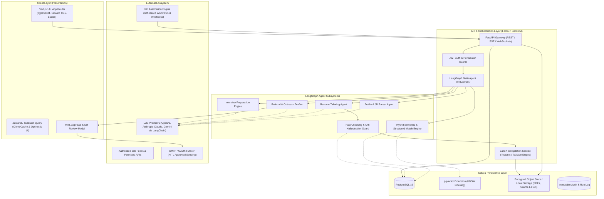
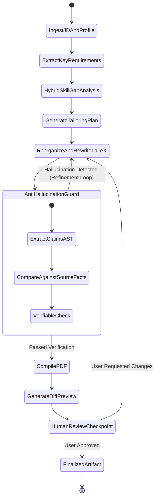
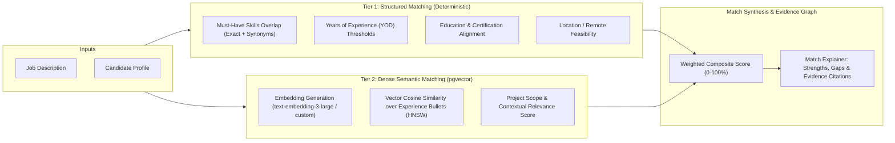
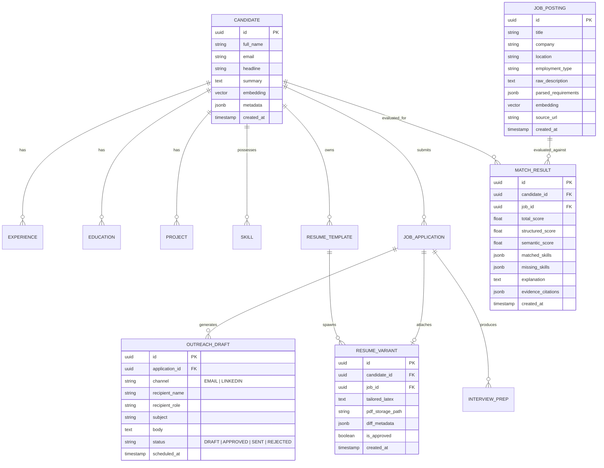
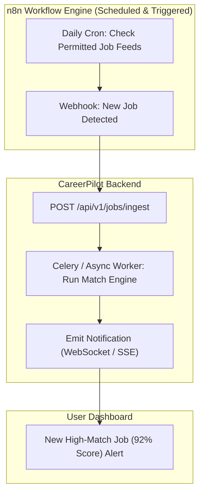

# CareerPilot AI — System Architecture Document

**Version:** 1.0.0  
**Status:** Approved Architecture Draft  
**Author:** Lead Software Architect & Senior AI Engineer  
**Last Updated:** September 2026  

---

## 1. Executive Summary & Vision

**CareerPilot AI** is an enterprise-grade, end-to-end career copilot designed to empower candidates with intelligent job search automation, high-precision semantic matching, strictly grounded LaTeX resume tailoring, referral discovery, and personalized interview preparation.

### Core Architectural Values
1. **Zero Hallucination & Fact-Grounded Integrity:** Resumes represent professional integrity. CareerPilot enforces verifiable claim grounding—guaranteeing that generated resumes reorganize, rewrite, and emphasize existing candidate achievements without fabricating titles, metrics, dates, companies, skills, or projects.
2. **Clean Architecture & Separation of Concerns:** Domain entities, business logic, storage adapters, and agent graphs are isolated with strict dependency boundaries.
3. **Human-in-the-Loop (HITL) Safety:** All consequential actions (sending outreach emails, applying to jobs, updating contact profiles) require explicit user review and approval.
4. **Unified Hybrid Data Layer:** Single-engine persistence combining relational integrity (PostgreSQL) and dense vector search (`pgvector`) for cost-effective, low-latency, and transactional data consistency.

---

## 2. High-Level System Architecture



---

## 3. Layered Clean Architecture

The backend adheres strictly to Clean Architecture principles:

```
backend/
├── app/
│   ├── api/                  # Presentation Layer: FastAPI Routes, Middlewares, Dependencies
│   │   ├── v1/               # Versioned REST Endpoints (profiles, jobs, matches, resumes, outreach)
│   │   ├── deps.py           # Dependency Injection (DB session, current user, storage client)
│   │   └── middleware.py     # Request ID, Logging, CORS, Error Handling
│   ├── core/                 # Core Configuration & Infrastructure
│   │   ├── config.py         # Pydantic BaseSettings (env validation)
│   │   ├── logging.py        # Structured JSON logging (structlog / loguru)
│   │   ├── security.py       # Password hashing, JWT token management
│   │   └── database.py       # SQLAlchemy 2.0 Async Session Factory
│   ├── domain/               # Domain Layer: Pure Business Entities & Value Objects (Zero external deps)
│   │   ├── models/           # Domain entities (Candidate, Job, MatchResult, ResumeVariant)
│   │   └── exceptions.py     # Domain-specific exceptions
│   ├── schemas/              # Data Transfer Objects (DTOs) via Pydantic v2
│   │   ├── candidate.py
│   │   ├── job.py
│   │   ├── match.py
│   │   ├── resume.py
│   │   ├── outreach.py
│   │   └── interview.py
│   ├── services/             # Application Layer: Use Cases & Business Logic
│   │   ├── parser_service.py # Extraction and AST parsing for LaTeX & Text
│   │   ├── matching_service.py # Hybrid search, cosine similarity, skill taxonomy
│   │   ├── latex_service.py  # LaTeX template rendering & PDF compilation
│   │   └── tracking_service.py # Application status lifecycle
│   ├── agents/               # LangGraph Agent Workflows & State Graphs
│   │   ├── state.py          # TypedDict Agent States & Reducers
│   │   ├── graphs/
│   │   │   ├── resume_tailor_graph.py
│   │   │   ├── match_explainer_graph.py
│   │   │   ├── outreach_drafter_graph.py
│   │   │   └── interview_prep_graph.py
│   │   ├── nodes/            # Isolated atomic agent nodes
│   │   └── guards/           # Fact grounding and negative constraint validators
│   └── infrastructure/       # Infrastructure Adapters: DB Models, Vector Repositories, External APIs
│       ├── db/
│       │   ├── models/       # SQLAlchemy ORM Tables
│       │   └── repositories/ # Async Repository pattern (CRUD & vector queries)
│       └── external/
│           ├── llm_client.py # Multi-provider LLM gateway
│           └── storage.py    # Local/S3 storage backend
```

---

## 4. Multi-Agent Orchestration with LangGraph

LangGraph powers complex multi-step workflows requiring state preservation, branching, deterministic guardrails, and Human-in-the-Loop checkpoints.

### 4.1. Resume Tailoring & Fact Grounding Subsystem



### 4.2. State Schema & Grounding Engine Specification

```python
# Conceptual LangGraph State Definition
from typing import Annotated, List, Dict, Optional
from typing_extensions import TypedDict
import operator

class ResumeTailorState(TypedDict):
    candidate_id: str
    job_id: str
    source_profile: Dict        # Structured canonical profile (source of truth)
    source_latex: str          # Original candidate LaTeX template
    target_job: Dict           # Parsed JD with core requirements & keywords
    matched_skills: List[str]
    missing_skills: List[str]
    tailoring_plan: Dict       # Action plan: which bullets to emphasize / reword
    candidate_draft_latex: str # Tailored LaTeX candidate
    verification_errors: List[str] # List of ungrounded or fabricated claims
    retry_count: int
    pdf_path: Optional[str]
    diff_summary: Dict
    is_approved_by_human: bool
```

---

## 5. Hybrid Semantic & Structured Matching Engine

To prevent semantic drift and ensure accurate evaluations, CareerPilot employs a two-tier matching strategy:



### Matching Formula:
$$\text{MatchScore} = w_{\text{struct}} \times \text{Score}_{\text{structured}} + w_{\text{sem}} \times \text{Score}_{\text{semantic}}$$
Where:
- $\text{Score}_{\text{structured}}$ penalizes critical missing "must-have" requirements.
- $\text{Score}_{\text{semantic}}$ evaluates contextual depth and responsibility alignment.
- Output includes explicit **evidence citations** (e.g., `Matched "FastAPI async design" to Experience #2 at Company X`).

---

## 6. Data Modeling & Database Schema (PostgreSQL + pgvector)



---

## 7. Zero-Hallucination & Quality Control Guarantees

### 7.1. Strict Invariant Rules
The resume tailoring agent operates under strict constraints:
1. **Fact Canonical Invariant:** The canonical candidate record (experiences, dates, positions, tech stack, metrics) is stored as immutable JSON.
2. **Negative Constraint Enforcement:** The LLM prompt explicitly restricts introducing any entity not present in the canonical record.
3. **AST & Metric Verification Pass:**
   - Any numerical metric (e.g., `40%`, `$2M`, `500k`) in the output is cross-verified against candidate source metrics.
   - Any extracted technology keyword must exist in candidate skill records or project descriptions.
   - If an unverified claim is detected, the graph cycles back with a targeted linting failure report.

---

## 8. Referral Discovery & Safe Outreach Architecture

CareerPilot maintains high ethical and legal compliance standards:
- **No Unauthorized Scraping:** No headless browser LinkedIn scraping or credentials hijacking.
- **Permitted Data Sources:** Public API feeds, Hunter.io / Apollo (authorized keys provided by user), user manual entry, and official corporate portals.
- **Draft-First HITL Guard:** All LinkedIn connection notes and referral email drafts are created in `DRAFT` status with a side-by-side editable review drawer in the UI.

---

## 9. Automation & Asynchronous Engine (n8n & Worker Architecture)



---

## 10. Security, Environment & Deployment Design

1. **Secrets Management:** Loaded exclusively via `.env` and validated through `pydantic-settings`.
2. **Data Encryption:** Sensitive tokens, resumes, and candidate profiles encrypted at rest.
3. **Containerization:** Docker Compose orchestration with isolated networks:
   - `frontend`: Next.js Node container
   - `backend`: FastAPI Uvicorn container
   - `db`: PostgreSQL 16 + pgvector container
   - `texlive`: Sandboxed LaTeX compilation worker
   - `n8n`: Workflow automation engine
4. **Telemetry & Auditability:** Structured JSON request logging, LangSmith / Langfuse tracing for agent runs, and immutable match audit logs.

---

## 11. Frontend Presentation Architecture & Design System

The frontend presentation layer has been designed according to an executive minimalist aesthetic (inspired by [TryRote](https://tryrote.com/)), tailored for high-stakes career management.

1. **Visual Language**: Pristine white canvas (`#FFFFFF`) with off-white card backgrounds (`#F8FAFC`), deep charcoal slate-900 typography, subtle 1px border dividers (`#E2E8F0`), and translucent navigation headers (`bg-white/80 backdrop-blur-md`).
2. **Component Token Consistency**: All interactive surfaces, buttons, modals, badges, inputs, and feedback states conform to unified tokens defined in `docs/design-system.md`.
3. **Deterministic State Handling**: Every asynchronous operation implements explicit `LoadingState`, `EmptyState`, and `ErrorState` components with retry hooks.
4. **SSR & Suspense Isolation**: Dynamic query param hooks (`useSearchParams`) are isolated within `<React.Suspense>` boundaries to guarantee zero-bailout Next.js 14 production builds.

---

## 12. Local Resilience & Dev Database Fallback

While production environments utilize PostgreSQL 16 with `pgvector`, the local development and testing environment automatically features an in-process SQLite fallback (`data/careerpilot_dev.db` via `aiosqlite`).
- Ensures instant developer onboarding without mandatory external Docker daemon dependencies.
- Automatically executes ORM table synchronization (`Base.metadata.create_all`) on startup.
- Complete feature parity across CRUD, match calculations, and agent pipelines.
