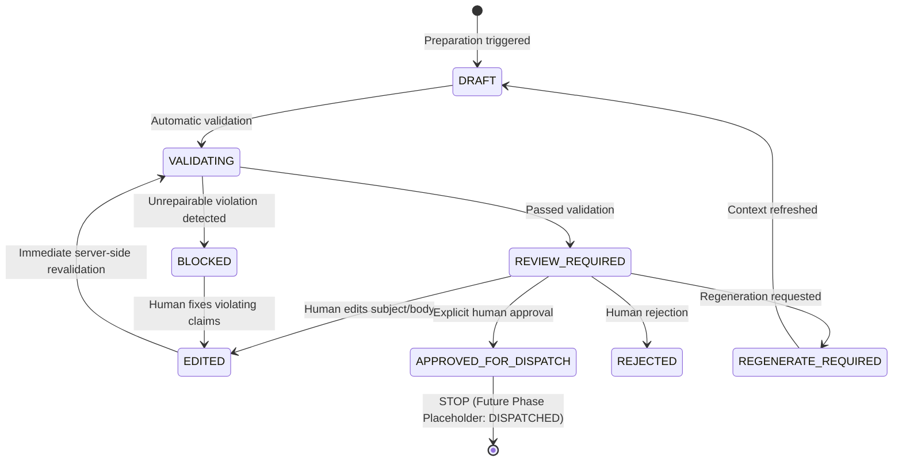

# CareerPilot — Phase 19: Outreach Preparation & Human Approval Engine

## 1. Overview & Core Objective
Phase 19 introduces the **Outreach Preparation & Human Approval Engine** to CareerPilot. Positioned immediately downstream of Phase 18's Referral Discovery and Contact Selection, Phase 19 generates tailored, truthful, and evidence-grounded outreach drafts (for LinkedIn and professional Email) and subjects them to rigorous multi-checkpoint safety and anti-fabrication validation.

> **CRITICAL BOUNDARY CONDITION:**
> **Phase 19 prepares and validates outreach drafts but does not transmit messages.**
>
> `APPROVE ≠ SEND`. Approval means:
> *"The human has reviewed and approved this message for a future dispatch step."*
>
> No external transmission, automated LinkedIn messaging, connection requests, cold emailing, or automated job applications occur in Phase 19.

---

## 2. End-to-End Pipeline & State Machine

```
MASTER CV (Immutable)
    ↓
CAREER PROFILE
    ↓
JOB DISCOVERY (Phase 16B)
    ↓
JD ANALYSIS & MATCH ENGINE
    ↓
TAILORED RESUME & PDF (Phase 17)
    ↓
HUMAN RESUME APPROVAL
    ↓
REFERRAL DISCOVERY (50+ Target, Phase 18)
    ↓
HUMAN CONTACT SELECTION
    ↓
[PHASE 19: OUTREACH PREPARATION]
    ↓
AI-GENERATED PERSONALIZED DRAFT
    ↓
12-POINT FACT / SAFETY VALIDATION
    ↓
HUMAN REVIEW & EDIT
    ↓
HUMAN APPROVAL
    ↓
APPROVED_FOR_DISPATCH
    ↓
[STOP — NO EXTERNAL TRANSMISSION]
```

### Outreach Draft Lifecycle State Machine



**State Transition Invariants:**
- `DRAFT → APPROVED_FOR_DISPATCH` is **strictly forbidden**. Validation must pass first.
- `EDITED → APPROVED_FOR_DISPATCH` is **strictly forbidden**. Any human edit resets status to `VALIDATING` and triggers automatic revalidation.
- `APPROVED_FOR_DISPATCH → DISPATCHED` is **strictly prohibited in Phase 19**.

---

## 3. Grounding & Zero Fabrication Invariants

1. **Master Resume Immutability:**
   $$\text{SHA256}(\text{master\_resume}_{\text{before}}) == \text{SHA256}(\text{master\_resume}_{\text{after}})$$
   Outreach drafting only reads facts from the approved candidate profile and tailored resume version. It has no write permissions on master resume assets.
2. **Zero Fabrication:**
   The generator never guesses or invents:
   - Work experience, internships, or achievements
   - Technologies, metrics, or certifications
   - Degrees, alma maters, or graduation dates
   - Mutual connections ("referred by X")
   - Conversations, shared communities, or previous interactions
   - Private contact details (residential addresses, personal cell numbers)
3. **Deterministic Personalization Evidence:**
   Every personalized claim in the generated message has an explicit, traceable evidence token:
   - `COMPANY`: Confirmed employee at the target organization
   - `ROLE`: Aligned engineering or recruiting title
   - `TEAM`: Specific engineering group or product team
   - `TECHNOLOGY`: Verified shared technical competencies
   - `PUBLIC_PROJECT`: Publicly verifiable candidate project
   - `ALUMNI`: Verified shared educational institution (only emitted if verified)
   - `GITHUB`: Public code contributions and repositories
   - `JOB_CONTEXT`: Target open requisition requirements

---

## 4. 12-Point Safety & Truth Validation Engine

The `OutreachValidatorAgent` evaluates all drafts (initial and edited) across 12 criteria:
1. **Candidate Claims Grounding:** Validates all candidate claims against candidate profile facts.
2. **Job Claims Grounding:** Validates requirements and role mentions against the job description.
3. **Contact Veracity:** Validates name, title, and employer against the referral record.
4. **Company Accuracy:** Verifies target company consistency.
5. **Personalization Evidence Grounding:** Verifies each personalized signal against evidence references.
6. **Zero Fabricated Relationships:** Scans for and hard-blocks unverified referral sources ("referred by John", "mutual friend").
7. **Contact Method Verification:** Restricts channels to public/professional methods.
8. **Sensitive Personal Data Protection:** Blocks residential addresses, personal phone numbers, and solicitation of private data.
9. **Anti-Hallucination & Metric Guardrails:** Filters ungrounded metric claims.
10. **Anti-Spam & Manipulative Phrasing:** Blocks desperate, demanding, or entitled phrasing ("urgently need a referral", "you are my only hope", "Dear Sir/Madam").
11. **Unsupported Urgency Filtering:** Strips artificial emergency claims.
12. **Automation Rule Compliance:** Rejects commands instructing the system to automatically send or bypass platform limits.

### Safe Self-Healing Repairs
When minor ungrounded conversational phrasing is encountered (e.g. unverified alumni mentions), the validator attempts up to **3 safe substitution cycles**, replacing the claim with grounded inquiry phrasing (e.g. *"I came across your profile while learning more about the engineering team at Datadog"*).
If ungrounded claims persist or hard violations (fabricated referral sources, private data leaks) exist, the draft is immediately marked **`BLOCKED`**.

---

## 5. Data Model & Database Migrations

### Model: `OutreachDraft` (`backend/app/models/outreach.py`)
- `id`: UUID (Primary Key)
- `candidate_id`: Foreign key to `candidates.id`
- `job_id`: Foreign key to `jobs.id`
- `referral_contact_id`: Foreign key to `referral_contacts.id`
- `resume_version_id`: Foreign key to `resume_versions.id`
- `channel`: Enum (`LINKEDIN`, `EMAIL`, `OTHER`)
- `subject`: Optional subject line (mandatory for Email)
- `body`: Draft message text
- `status`: Enum (`DRAFT`, `VALIDATING`, `REVIEW_REQUIRED`, `EDITED`, `APPROVED_FOR_DISPATCH`, `REJECTED`, `REGENERATE_REQUIRED`, `BLOCKED`, `DISPATCHED`)
- `generation_version`: Integer tracking regeneration attempts
- `prompt_version`: Prompt template version string
- `personalization_evidence`: JSON array of verified evidence objects
- `validation_results`: JSON object containing passed flag, risk level, and claims breakdown
- `risk_flags`: JSON array of detected policy flags
- `approved_at`, `approved_by`: Timestamp and human approver ID
- `rejected_at`, `rejected_by`: Timestamp and rejector ID
- `human_edits`: JSON array capturing diffs, editors, timestamps, and change summaries
- `dispatch_status`: `NOT_DISPATCHED` (immutable in Phase 19)
- `audit_metadata`: JSON dictionary containing `{"NO_MESSAGE_SENT": True}`

### Model: `OutreachAuditEvent` (`backend/app/models/outreach.py`)
Records immutable audit logs for:
- `OUTREACH_DRAFT_CREATED`
- `OUTREACH_GENERATED`
- `OUTREACH_VALIDATED`
- `OUTREACH_REPAIR_ATTEMPTED`
- `OUTREACH_EDITED`
- `OUTREACH_APPROVED`
- `OUTREACH_REJECTED`
- `OUTREACH_REGENERATED`

Alembic migration: `backend/alembic/versions/0017_add_outreach_drafts.py`.

---

## 6. API Endpoints

All endpoints are hosted under `/api/v1/outreach` (with `/api/outreach` backward compatibility):

| Method | Endpoint | Description |
|---|---|---|
| `POST` | `/api/v1/outreach/drafts` | Create an evidence-grounded draft for one contact |
| `POST` | `/api/v1/outreach/generate` | Generate/regenerate personalized draft |
| `POST` | `/api/v1/outreach/bulk-generate` | Bulk generate drafts for selected referral contacts |
| `GET` | `/api/v1/outreach` | List outreach drafts with filtering (`job_id`, `status`, `channel`, `risk_level`) |
| `GET` | `/api/v1/outreach/{id}` | Get complete draft details with contact context and evidence |
| `POST` | `/api/v1/outreach/{id}/validate` | Run 12-point truth & safety validation |
| `PATCH` | `/api/v1/outreach/{id}` | Save human edits to subject/body and trigger revalidation |
| `POST` | `/api/v1/outreach/{id}/approve` | Sign off and transition to `APPROVED_FOR_DISPATCH` |
| `POST` | `/api/v1/outreach/{id}/reject` | Reject draft |
| `POST` | `/api/v1/outreach/{id}/regenerate` | Regenerate draft with fresh facts |
| `GET` | `/api/v1/outreach/job/{job_id}` | Fetch all drafts for a given job |
| `GET` | `/api/v1/outreach/contact/{contact_id}` | Fetch all drafts for a given referral contact |

---

## 7. Frontend Architecture

### 1. Outreach Dashboard (`/outreach`)
- **Metric Cards:** Total Drafts, Needs Review, Validated, Approved, Blocked, Rejected.
- **Filters:** Opportunity selector, Channel filter, Status filter, Risk Level filter, and live text search.
- **Draft Cards:** Displays contact name, role, company, relevance score, channel badge with *"Prepared — not sent"*, personalization evidence tokens, validation status badge, and *"Review Draft"* action.

### 2. Outreach Review Studio (`/outreach/[draftId]`)
- **Contact Context:** Name, title, company, relationship type, relevance score, source links.
- **Job Context:** Position title, target employer, key requirements.
- **Verified Evidence:** Transparent breakdown of why the person was selected (Company, Team, GitHub, Tech overlap).
- **12-Point Validation Checklist:** Live visual indicators verifying all facts and safety rules.
- **Message Editor:** Editable subject and body fields with live character counter (LinkedIn: 500–900 chars, Email: 700–1400 chars).
- **Audit Trail:** History of AI generation, human edits, revalidations, and approval timestamps with `NO_MESSAGE_SENT = TRUE`.
- **Action Controls:** `[Regenerate]`, `[Validate]`, `[Save Edit]`, `[Reject]`, `[Approve for Dispatch]`.

---

## 8. n8n Workflow Coordination

- **Workflow ID:** `CPOutreachPreparation001`
- **File:** `workflows/outreach_preparation_workflow.json`
- **Function:** Orchestrates preparation triggers, delegates drafting and validation to FastAPI (`POST /api/v1/outreach/bulk-generate`), and emits human review notifications.
- **Guardrail:** Contains **zero** dispatch or transmission nodes. FastAPI remains the single source of truth.

---

## 9. Phase 19 Stop Condition

```
JOB DISCOVERED
    ↓
APPROVED RESUME
    ↓
REFERRAL DISCOVERY
    ↓
CONTACT SELECTION
    ↓
OUTREACH PREPARATION
    ↓
VALIDATION
    ↓
HUMAN EDIT
    ↓
HUMAN APPROVAL
    ↓
APPROVED_FOR_DISPATCH
    ↓
STOP
```

Phase 19 strictly halts at `APPROVED_FOR_DISPATCH`. No external communication is initiated.
