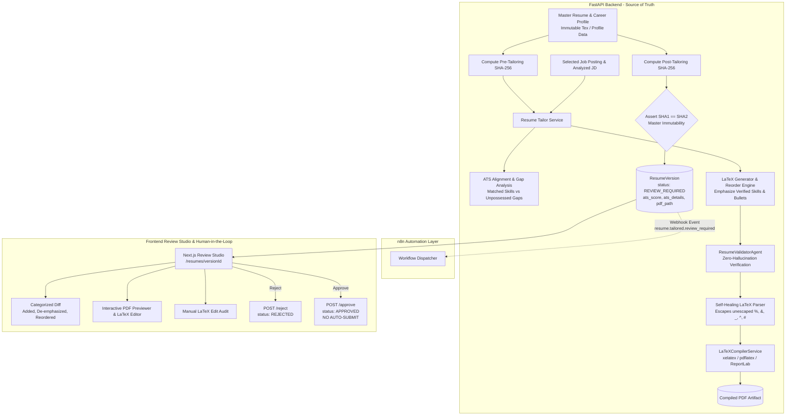

# CareerPilot — AI Resume Tailoring, LaTeX & PDF Generation Pipeline (Phase 17)

## 1. System Architecture & Overview

CareerPilot's resume preparation pipeline automatically transforms a candidate's immutable master career record into an evidence-grounded, ATS-aligned, and compilation-verified LaTeX resume for a specific job posting.

The architecture enforces strict separation between candidate facts, job requirements, tailoring algorithms, document compilation, and human review:

---

## 2. Non-Negotiable Core Invariants

### 2.1 Master Resume Immutability Guarantee
The master resume ([`resume/master/sample_master_resume.tex`](file:///Users/zaidhaque/Desktop/CareerPilot/resume/master/sample_master_resume.tex)) and underlying candidate profile represent ground-truth reality.
- **Cryptographic Guardrail**: Before tailoring begins, the system computes the SHA-256 hash of the master resume file.
- After tailored resume generation and compilation, the SHA-256 hash is re-computed.
- If `sha256_before != sha256_after`, the transaction aborts with `RuntimeError("CRITICAL SAFETY VIOLATION: Master resume file was modified during tailoring!")`.
- Tailored resumes are stored as distinct `ResumeVersion` records linked to the target `Job` and `Candidate`, never overwriting the master source.

### 2.2 Zero-Hallucination & Truthfulness Invariant
- **Evidence-Based Tailoring Only**: The tailoring engine strictly uses verified candidate skills, experiences, projects, and educational achievements present in the candidate profile and master resume.
- **Transparent Gap Detection**: When a job description requires technologies or credentials the candidate does *not* possess (e.g., Ruby on Rails, Snowflake), the pipeline **never invents them**.
- Missing requirements are categorized into `ats_details["potential_gaps"]` and surfaced directly in the UI as honest career skill gaps rather than falsely inserted into the resume.
- **Validation Audit**: The [`ResumeValidatorAgent`](file:///Users/zaidhaque/Desktop/CareerPilot/backend/app/agents/resume_validator_agent.py) compares every line and metric in the generated LaTeX against candidate records. Any ungrounded metric, project, or title triggers automatic rejection.

### 2.3 Human-in-the-Loop Approval (No Auto-Submit)
- **Mandatory Review State**: Every tailored resume is initialized with `status="REVIEW_REQUIRED"`.
- **Blocked Autonomous Execution**: Neither FastAPI nor n8n will ever submit an application, message a recruiter, or send an email autonomously.
- **Explicit Approval**: The status transitions to `APPROVED` only when the user explicitly clicks **Approve Resume** (`POST /api/v1/resumes/tailored/{version_id}/approve`).
- The application counter in the CRM remains unchanged during tailoring and compilation; no application record is created or moved without human review.

---

## 3. LaTeX & PDF Compiler Pipeline

The compilation engine ([`backend/app/services/latex_compiler_service.py`](file:///Users/zaidhaque/Desktop/CareerPilot/backend/app/services/latex_compiler_service.py)) provides isolated, sandboxed PDF rendering with multiple fallback tiers:

### 3.1 Compilation Workflow
1. **Source Sanitization**: Validates that no forbidden LaTeX commands (e.g., `\write18`, `\input{/etc/passwd}`, `\openin`) are present.
2. **Self-Healing Syntax Repair**: `_repair_latex_source()` detects common LLM generation defects:
   - Unescaped special characters (`%`, `&`, `_`, `#`, `^`, `$`)
   - Missing `\begin{document}` or `\end{document}`
   - Unclosed environments (`itemize`, `enumerate`)
3. **Multi-Engine Execution**:
   - Primary: `xelatex -no-shell-escape -interaction=nonstopmode`
   - Secondary: `pdflatex -no-shell-escape -interaction=nonstopmode`
   - Resilient Fallback: Isolated ReportLab engine generates a cleanly formatted, printable PDF if local TeX distributions are absent or encountering missing packages.
4. **Artifact Storage**: Output PDFs are stored under `storage/resumes/{version_id}.pdf` and served securely via streaming API.

---

## 4. Categorized Diff Engine

CareerPilot generates a structured comparison between the master resume and the tailored resume:

| Category | Definition | Visual Indication in UI |
| :--- | :--- | :--- |
| `ADDED / EMPHASIZED` | Relevant candidate skills or experience bullets highlighted to match JD keywords | Emerald badge with `+` sign |
| `DE-EMPHASIZED` | Bullet points or skills de-prioritized to give prominence to relevant tech | Muted gray badge |
| `REORDERED` | Sections or bullet points moved higher up for direct JD alignment | Blue badge with swap icon |
| `UNCHANGED` | Base contact info, verified degree, and baseline role headers preserved | Neutral label |
| `REMOVED` | Redundant lines trimmed to maintain single-page density | Red badge with `-` sign |

---

## 5. API Reference

All endpoints are prefixed with `/api/v1/resumes`:

### Tailoring & Compilation
- `POST /api/v1/resumes/tailor`
  - **Body**: `{ "job_id": "<uuid>", "target_role": "...", "job_description": "..." }`
  - **Action**: Runs full pipeline: SHA-256 pre-check, JD analysis, ATS scoring, LaTeX generation, compilation, SHA-256 post-check, creates `ResumeVersion` (`status: REVIEW_REQUIRED`).
  - **Response**: `{ "version_id": "...", "status": "REVIEW_REQUIRED", "ats_score": 85.0, "pdf_path": "...", "ats_details": {...} }`

- `GET /api/v1/resumes/tailored`
  - **Query**: `candidate_id` (optional), `job_id` (optional), `limit` (default: 20)
  - **Response**: List of tailored resumes with status badges, ATS scores, and metadata.

- `GET /api/v1/resumes/tailored/{version_id}`
  - **Response**: Full record including `latex_content`, `status`, `ats_score`, `ats_details`, `pdf_path`, `validation_details`.

- `POST /api/v1/resumes/tailored/{version_id}/compile`
  - **Action**: Manually triggers LaTeX compilation for an existing version.
  - **Response**: `{ "status": "compiled", "pdf_path": "...", "compilation_time_ms": 28.5 }`

- `GET /api/v1/resumes/tailored/{version_id}/pdf`
  - **Response**: Streams binary `application/pdf` with `Content-Disposition: inline`.

### Review & Governance
- `GET /api/v1/resumes/tailored/{version_id}/diff`
  - **Response**: Categorized diff breakdown (`items: [{ category, original_text, tailored_text, reason }]`).

- `POST /api/v1/resumes/tailored/{version_id}/approve`
  - **Body**: `{ "candidate_profile_id": "...", "notes": "Approved for application" }`
  - **Action**: Sets `status="APPROVED"`, records `approved_at`, emits n8n event `resume.approved`. **Does not auto-submit**.

- `POST /api/v1/resumes/tailored/{version_id}/reject`
  - **Body**: `{ "candidate_profile_id": "...", "rejection_reason": "Needs more emphasis on Kubernetes" }`
  - **Action**: Sets `status="REJECTED"`, records `rejection_reason`.

- `PATCH /api/v1/resumes/tailored/{version_id}/latex`
  - **Body**: `{ "latex_source": "..." }`
  - **Action**: Audits user-provided LaTeX against candidate profile with `ResumeValidatorAgent`. If valid, recompiles PDF and updates ATS scores.

---

## 6. Frontend Review Studio

The CareerPilot frontend provides a full-featured studio for reviewing and modifying tailored resumes:

- **Hero Metadata Card**: Displays Target Role, Company, Deterministic Match %, ATS Coverage %, and Lifecycle Status Badge (`REVIEW_REQUIRED`, `APPROVED`, `REJECTED`).
- **"Why These Changes" & "Potential Gaps" Panel**: Transparent explanations showing which verified candidate skills were prioritized, and which missing JD requirements were flagged as gaps.
- **Categorized Diff View**: Side-by-side or stacked diff highlighting added, de-emphasized, and reordered items.
- **Editable LaTeX Editor**: Monospace code editor with syntax preservation, line numbers, and a **Recompile & Audit** action.
- **Split PDF Previewer**: Interactive browser viewer embedding the generated PDF with one-click **Download**, **Copy LaTeX**, and **Open in Overleaf** integration.
- **HITL Governance Bar**: Sticky action bar with **Approve Resume** and **Request Changes / Reject** buttons.

---

## 7. Testing & Verification

The Phase 17 pipeline is thoroughly validated with 79 backend automated tests and end-to-end integration tests:

1. **Master Resume Immutability**: Verified by calculating SHA-256 before and after tailoring operations (`test_master_resume_immutability`).
2. **Zero-Hallucination & ATS Gaps**: Tested with unpossessed skills (Ruby on Rails, Snowflake) to ensure they are excluded from the resume and recorded under `potential_gaps` (`test_zero_hallucination_and_ats_gaps`).
3. **Self-Healing LaTeX Parser**: Malformed LaTeX syntax errors (unescaped %, unclosed environments) are automatically repaired and compiled (`test_latex_compilation_and_self_healing_repair`).
4. **Approval & Rejection Workflow**: Verified status transitions from `REVIEW_REQUIRED` to `APPROVED` and `REJECTED` (`test_approval_and_rejection_workflows`).
5. **Manual Edit Safety**: Manual edits containing unverified technologies are caught and rejected by `ResumeValidatorAgent` (`test_manual_latex_edits_safety`).
6. **Frontend Production Build**: All 20 Next.js routes built and typechecked with 0 errors (`npm --prefix frontend run build`).
7. **End-to-End Live Verification**: Complete execution of the 15-step pipeline on live backend with Datadog test job (`scripts/verify_phase17_e2e.py`).

---

## 8. Known Limitations & Next Steps

- **Overleaf Export**: Export generates a direct Overleaf POST payload or downloadable `.tex` package. Direct API sync requires Overleaf premium enterprise tokens.
- **Complex Macro Templates**: Custom LaTeX templates relying on rare third-party packages fall back to ReportLab compilation when TeX Live is not installed locally.
- **Phase 18 Transition**: Resume preparation pipeline halts cleanly after human approval. Referral discovery, networking contact identification, and outreach drafting are deferred to Phase 18.
